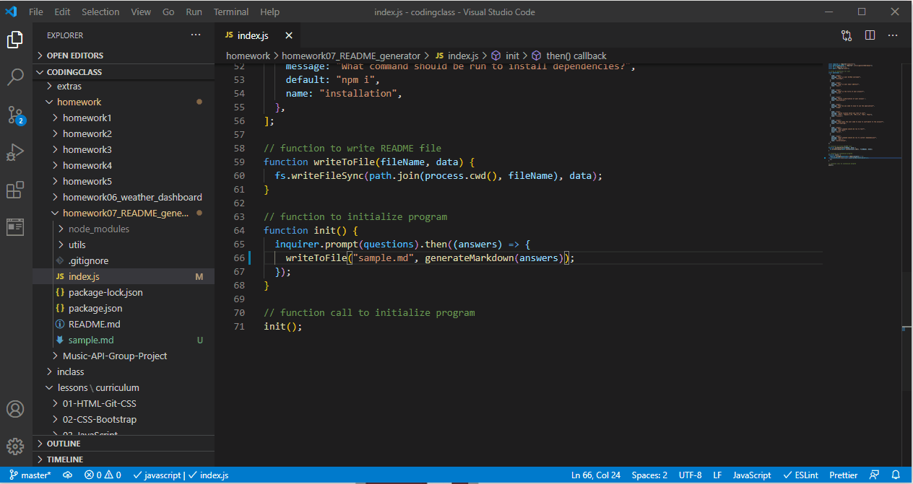

# README Generator
  

## Description

When creating an open source project on GitHub, it is important to have a quality README with information about the app--what is the app for, how to use the app, how to install it, how to report issues, and how to make contributions so that other developers are more likely to use and contribute to the success of the project. A command-line application will allow for quick and easy generation of a project README to get started quickly. This will allow a project creator to spend more time working on finishing the project and less time creating a good README.

## Table of Contents

* [installation](#installation)
* [usage](#usage)
* [license](#license)
* [contributing](#contributing)
* [test](#tests)
* [questions](#questions)

To install necessary dependencies run the following command

npm i

## Usage

Open your terminal, navigate to where the README generator is located, install the npm packages and follow the prompts.

## License
      
      This project is licensed under the MIT license.

## Contributing

N/A

## Tests
To run test run the following command:
'''
npm test
'''

## How the deployed application looks and works

## Questions
If you have any questions about the repo contact me directly at c.trahan94@yahoo.com.
You can find more of my work at [ctrahan94](https://github.com/ctrahan94).

